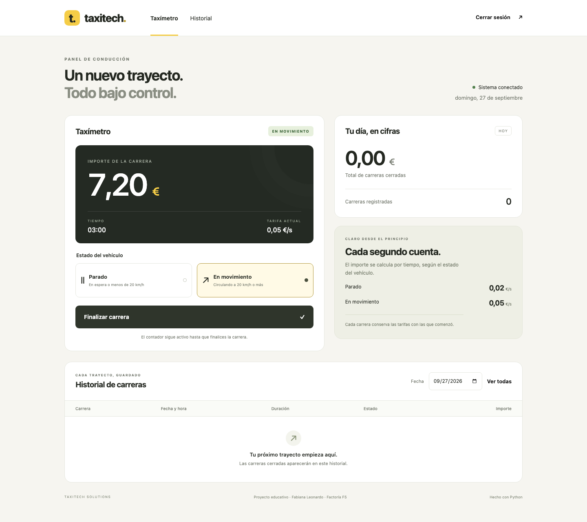

# TaxiTech

## Taxímetro digital en Python

**Memoria técnica del proyecto · Factoría F5 / IA School**

**Autora:** Fabiana Leonardo

**Identidad Git del proyecto:** es.fabileo@gmail.com

**Fecha:** 27 de septiembre de 2026

**Alcance:** cuatro fases incrementales, desde una interfaz de terminal hasta una aplicación web con historial relacional y API.

| Entregable | Localización |
|---|---|
| Código y versiones | github.com/fabileoruf/project-py-taximetro |
| Kanban por fases | github.com/users/fabileoruf/projects/3 |
| Ejecución principal | python3 iniciar.py |
| Demostración | docs/demo.md |

El proyecto implementa un taxímetro educativo para un vehículo. El conductor inicia una carrera, alterna entre espera y movimiento, consulta el importe y finaliza el servicio. Las carreras cerradas permanecen disponibles después de reiniciar la aplicación.

El repositorio conserva una etiqueta por fase: fase-1, fase-2, fase-3 y fase-4. La versión final reúne todas las funcionalidades. El arranque principal utiliza Python directamente; Docker queda como alternativa opcional.

---

## 01 / Terminal y cálculo

La primera fase ofrece instrucciones al arrancar y comandos para iniciar, cambiar el estado, consultar, finalizar y encadenar carreras. Cada carrera comienza parada. Los comandos se confirman con Enter.

La tabla recoge los comandos de la versión final; el historial se incorpora en la segunda fase.

| Comando | Acción |
|---|---|
| i / f | Iniciar / finalizar y guardar una carrera |
| p / m | Cambiar a parado / en movimiento |
| e / h | Consultar el contador / consultar el historial |
| a / q | Mostrar ayuda / salir |

El cálculo usa las tarifas del ejercicio: 0,02 euros por segundo parado y 0,05 euros por segundo en movimiento. Se mide la duración real de cada tramo mediante un reloj monotónico en nanosegundos. Así, un ajuste de la hora del sistema no altera el tiempo de la carrera.

Las tarifas se representan con Decimal. Los tramos se acumulan sin redondear y el importe se presenta con dos decimales, aplicando redondeo hacia arriba en el medio céntimo. Consultar el contador no modifica el precio.

**Ejemplo comprobado:** 60 segundos parado y 120 en movimiento cuestan 60 × 0,02 + 120 × 0,05 = 7,20 euros.

## 02 / Historial, registros y tarifas

La segunda fase guarda una línea JSON por carrera terminada. Incluye identificador, fecha, duración, tiempos por estado, tarifas e importe. El ID evita duplicados al reintentar una escritura.

Los eventos se registran en un archivo JSONL con rotación: arranque, inicio, cambios de estado, cierre y errores. No se registran las contraseñas.

El archivo config.json permite cambiar las tarifas sin editar el código. La validación rechaza valores no positivos o no finitos. Cada carrera conserva sus tarifas iniciales y la siguiente utiliza las actualizadas.

---

## 03 / Arquitectura e interfaz

La lógica se separa de la presentación para que terminal y navegador utilicen los mismos casos de uso y produzcan el mismo resultado.

| Componente | Responsabilidad |
|---|---|
| Taximeter y Rates | Medir tramos, validar estados y calcular el importe. |
| MeterService | Iniciar, cambiar, finalizar, consultar y coordinar persistencia. |
| SQLiteHistory / JsonHistory | Guardar y recuperar los datos según la fase. |
| EventLog | Escribir eventos estructurados con rotación. |
| security.py | Configurar y comprobar la contraseña. |
| cli.py / web.py | Interfaz de terminal / interfaz web y API. |

La interfaz web utiliza Flask con el servidor Waitress. El navegador presenta HTML, CSS y JavaScript; Python calcula el precio en el servidor. La pantalla se adapta a ordenador, tablet y móvil. Ofrece controles grandes, estado visible, importe, duración, resumen del día e historial.

El contador se consulta aproximadamente cada 0,7 segundos sin bloquear la interacción. Si falla la conexión, se muestra un aviso y se desactivan los controles hasta recuperar el contacto. Cerrar el navegador no finaliza una carrera mientras el servidor sigue funcionando.

### Acceso

La primera ejecución pide crear una contraseña de al menos diez caracteres. Se guarda un hash scrypt con sal y una clave aleatoria para firmar las sesiones. El archivo de credenciales tiene permisos 0600 y queda fuera de Git.

La API exige sesión para acceder al negocio y un token CSRF para las operaciones que modifican datos. Tras cinco intentos fallidos de acceso se limita temporalmente esa dirección. Las cookies incluyen HttpOnly y SameSite; la configuración permite activar Secure cuando se instala HTTPS.

Un bloqueo por carpeta evita que dos procesos administren el mismo taxímetro. Un bloqueo interno serializa peticiones concurrentes y evita iniciar dos carreras a la vez.

---

## 04 / Base de datos y API

La versión final utiliza SQLite, incluido en Python. La tabla trips almacena las carreras con clave primaria, fechas, tiempos por estado, tarifas, importe en céntimos y estado de finalización. Las restricciones rechazan tiempos o importes negativos y estados inválidos.

La migración importa el archivo JSONL de la segunda fase en una transacción y puede repetirse sin duplicar filas. Si un registro no es válido, se revierte la importación.

### Reinicios y fallos

Al iniciar, cambiar el estado y consultar una carrera se guarda un punto de recuperación. Después de un cierre inesperado, ese punto pasa al historial como carrera interrumpida. El tiempo con el servidor apagado no se cobra. La pantalla indica que el conductor debe revisar el importe.

Si el navegador no consulta el contador, el último punto guardado puede ser anterior al cierre. Esta limitación se documenta; no se inventa tiempo que no haya quedado registrado. Si falla la escritura al finalizar, se conserva el importe para reintentar sin cobrar tiempo adicional.

### Operaciones de la API

| Método y ruta | Resultado |
|---|---|
| GET /api/csrf | Cookie y token para comenzar una sesión. |
| POST /api/login | Autenticación y renovación del token. |
| GET /api/status | Carrera activa y resumen del día. |
| POST /api/trips | Inicio de una carrera. |
| PATCH /api/trips/current | Cambio de estado. |
| POST /api/trips/current/finish | Finalización y guardado. |
| GET /api/trips | Historial; admite filtro date. |
| POST /api/logout | Cierre de sesión. |

La documentación incluye un cliente de ejemplo en Python. Los errores distinguen datos inválidos, ausencia de sesión, CSRF inválido, conflicto de estado, exceso de intentos y fallo operativo.

---

## La aplicación en funcionamiento

La captura corresponde a una prueba automatizada: 60 segundos en parado y 120 en movimiento, con un total de 7,20 euros. Los datos de demostración se crean en una carpeta temporal, separada de los datos personales.

Los botones permiten alternar estados y cerrar la carrera. El panel lateral presenta el total diario y las tarifas. Debajo aparece el historial con filtro de fecha. La visualización del día utiliza la zona horaria Europe/Madrid.

Las capturas de acceso, historial, tablet y móvil se incluyen en docs/images. Las pantallas no dependen de servicios gráficos ni fuentes externas.

---

## Validación y resultados

Se ejecutaron 26 pruebas automatizadas de Python, además de pruebas reales de navegador y de arranque nativo entre procesos.

| Grupo | Casos comprobados |
|---|---|
| Cálculo: 7 pruebas | Tramos mixtos, medio céntimo, consultas repetidas, fin inmutable, estados y tarifas inválidos. |
| Archivos: 3 pruebas | Persistencia entre instancias, configuración externa e historial corrupto. |
| SQLite y servicio: 10 pruebas | Reinicio, interrupción, reintentos, fallos de disco simulados, concurrencia, tarifas, migración, día de Madrid y bloqueo. |
| Web: 6 pruebas | Autenticación, CSRF, carrera completa, errores, límite de intentos, salida y cabeceras. |
| Navegador real | Acceso, carrera mixta, nueva carrera, filtros, desconexión, reconexión y cierre de sesión. |
| Arranque nativo | Configuración inicial, terminal, comando Python, API y datos tras reiniciar el servidor. |

El navegador se probó a 1440, 768 y 390 píxeles de ancho, sin desbordamiento horizontal de la página. La tabla permite desplazamiento horizontal en pantallas estrechas. El flujo no produjo errores JavaScript sin gestionar.

La integración continua configura pruebas en Python 3.11 y 3.14, además de una prueba de navegador. Las capturas se pueden regenerar mediante tests/browser_check.py.

### Límites del prototipo

El alcance es un vehículo y un acceso compartido. No se incluyen GPS, varios vehículos, facturación fiscal ni homologación. Las tarifas pertenecen al ejercicio. El servicio se entrega para uso local; una instalación pública requiere configurar HTTPS.

La recuperación conserva lo efectivamente guardado. Una carrera interrumpida necesita revisión antes de cobrar. La versión nativa está orientada a macOS y Linux, por el bloqueo de proceso utilizado.

---

## Ejecución y presentación

Desde la carpeta del proyecto, ejecuta:

`python3 iniciar.py`

El lanzador prepara el entorno virtual, instala las dependencias cuando es necesario, solicita una contraseña al primer uso y arranca la aplicación. Abre http://127.0.0.1:8080. Para el terminal, utiliza `python3 iniciar.py cli`.

Las dependencias principales son Flask, Waitress y Werkzeug, declaradas en requirements.txt. Los datos locales se guardan en data/ y se mantienen al parar y reiniciar. Docker se ofrece únicamente como alternativa; no es necesario para la demostración.

### Guion de demostración

- Presentar las cuatro fases y el tablero Kanban.
- Arrancar con Python e iniciar sesión.
- Iniciar una carrera, cambiar de parado a movimiento y finalizar.
- Iniciar otra carrera y mostrar ambas en el historial.
- Explicar las tarifas y comprobar la persistencia tras reiniciar.
- Mostrar las pruebas y las decisiones principales del código.

### Entrega en el campus

Pegar el enlace al repositorio y al tablero en el campo de texto, y adjuntar esta memoria en PDF. El guion completo está en docs/demo.md. La demostración se ejecuta localmente; no se presenta un enlace de alojamiento público de la aplicación.

El repositorio y el tablero se crearon privados. Antes de entregar sus enlaces, deben hacerse accesibles al profesor mediante invitación o cambio de visibilidad. El envío en el campus queda a cargo de la alumna.

### Referencias

- Enunciado: https://github.com/Factoria-F5-madrid/project-py-taximetro
- Python, reloj monotónico: https://docs.python.org/3/library/time.html
- Python, Decimal: https://docs.python.org/3/library/decimal.html
- Python, SQLite: https://docs.python.org/3/library/sqlite3.html
- Flask: https://flask.palletsprojects.com/en/stable/

El código y la documentación se prepararon con asistencia de IA. La revisión, comprensión y presentación del trabajo corresponden a la alumna.
